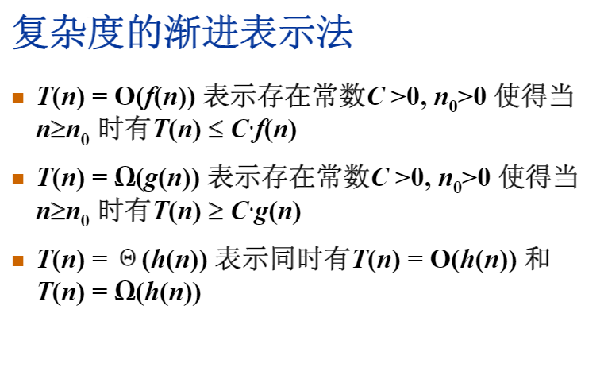
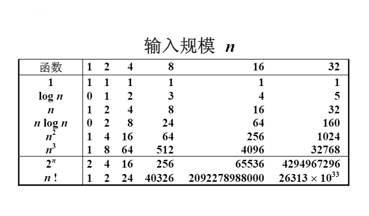
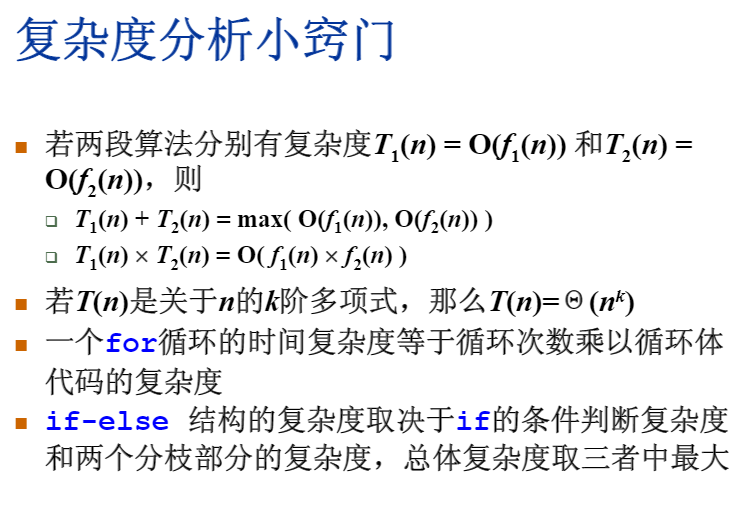

# 算法

1. [定义](#定义)
   1. [五个重要特性](#五个重要特性)
   2. [好的算法](#好的算法)
   3. [复杂度的渐进表示](#复杂度的渐进表示)
   4. [最大子列和问题](#最大子列和问题)
2. [排序算法](#排序算法)
   1. [二分法](#二分法)
   2. [快速排序算法](#快速排序算法)
   3. [内排序](#内排序)
   4. [外排序](#外排序)
3. [查找算法](#查找算法)
4. [搜索算法](#搜索算法)
5. [滑动窗口](#滑动窗口)

## 定义

- Algorithm
- 一个有限指令集
- 接受一些输入（有些情况下不需要输入）
- 产生输出
- 一定在有限步骤之后终止
- 每一条指令：有充分明确的目标，不可以有歧义；在计算机能处理的范围之内；描述应不依赖于任何一种计算机语言以及具体实现
- 所以学习算法最重要的是学习算法的设计过程（算法思维），而不是算法本身，理论要与实践相结合
- 等到算法能力掌握到一定程度的时候，再去学习复杂度算法这些
- 数据结构的价值，在于其思维逻辑结构层面的价值

### 五个重要特性

1. 有穷性
2. 确定性
3. 可行性： 可以通过基本运算有限次执行来实现
4. 有输入
5. 有输出

```java
// 示例： 选择排序伪代码
void SelectionSort (int List[], int N) {
    for(int i = 0; i < N; i++) {
        // 从List[i] 到 List[N-1] 中找最小元，并将其位置赋值给MinPosition
        MinPostion = ScanForMin(List, i, N-1)
        // 将未排序部分的最小元换到有序部分的最后位置
        Swap(List[i], List[MinPosition])
    }
}
```

### 好的算法

指标：

1. 空间复杂度S(n) Space
    
    - 写成的程序在执行时占用存储单元的长度
    - 长度往往与输入数据的规模n有关

2. 事件复杂度T(n) Time
    
    - 写成的程序在执行时耗费时间的长度
    - 长度往往与输入数据的规模n有关
    - 机器运算加减法要比乘除法要快很多

分析一般算法的效率：

1. 最坏情况复杂度T<sub>worst</sub>(n)
2. 平均复杂度T<sub>avg</sub>(n)
    T<sub>avg</sub>(n) <= T<sub>worst</sub>(n)
3. 所以一般就分析最坏情况复杂度


### 复杂度的渐进表示

- 
- 
- 

### 最大子列和问题

```java
// 给定N个整数的序列{ A1,... An}, 求函数f(i, j) = max{0, ∑ k=i j Ak} 的最大值
```

## 排序算法

### 二分法

```java
void HalfSort(int List[], int N, int X) {
    // 取中间值, Min , Max
    Min = 0
    Max = N - 1
    Middle = (Max + Min)/2
    
    while(Min <= Max) {
        if (List[Middle] < X) {
            Min = Middle
            Middle = (Max + Min)/2
        } else if (List[Middle] > X) {
            Max = Middle
            Middle = (Max + Min)/2
        } else {
            return Middle
        }
    }
    // 没找到
    return -1
}
// 空间复杂度 S(n) = O(1)
// 时间复杂度：T(n) 最好 O(1), 最坏： C log(n)
```

### 快速排序算法

- 选定基准值
- 分区（小于基准值放左边，大于基准值放右边）；
- 对于左边与右边的分区递归进行分区（partition）；
- 第一次轮n次；第二次轮n-1次，，，联想到二叉树，树的高度越低效率就越高

```js
// 选择排序
console.time(1);
let arr = [8,3,24,45,33,23,41,54,33,22,7,7,4,9,0,110];
let sortedArr = [];
function chooseSort(arr) {
  if(arr.length == 0) {
    return
  }
  for(let i = 1, len = arr.length; i < len; i++) {
    if(arr[i] <= arr[0]) {
      let temp = arr[0];
      arr[0] = arr[i];
      arr[i] = temp;
    }
  }
  sortedArr.push(arr.splice(0,1)[0]);
  chooseSort(arr);
}
// chooseSort(arr);
// console.log(sortedArr);

// arr.sort((a,b) => {
//   return a-b;
// })
// console.log(arr)

console.timeEnd(1);

// 快速排序
console.time(2);
let arr = [8,3,24,45,33,23,41,54,33,22,7,7,4,9,0,110];
function quickSort(arr) {
  if(arr.length < 2) {
    return arr;
  }
  let basic = arr[0];
  let left = [];
  let right = [];
  for(let i = 1, len = arr.length; i < len; i++) {
    if(arr[i] < basic) {
      left.push(arr[i])
    }
    if(arr[i] >= basic) {
      right.push(arr[i])
    }
  }
  return quickSort(left).concat([basic]).concat(quickSort(right));
}
console.log(quickSort(arr));
console.timeEnd(2);

```

- 快排优化

- 快速选择算法(只是想找排名第K个的元素)

> 当我们需要快速找到一个元素X，并且使得小于X的元素数量是K-1个时，那X就是我们要查找的排名第K位的元素了，可以用partition;

- 堆排序
- 归并排序
- 其它趣味算法

- 红黑树
- 哈希表

### 内排序


### 外排序

## 查找算法

## 搜索算法

- 深度优先搜索
- 广度优先搜索

描述算法的常用工具 - 程序框图（流程图）

## 滑动窗口
